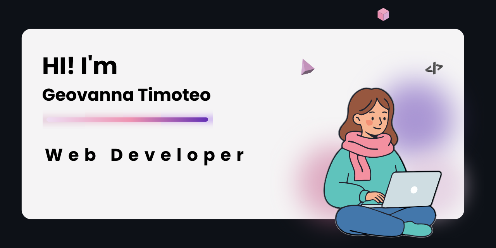

  

###

<h2 align="left">Olá!  Meu nome é Geovanna, Tenho formação técnica em Informática para Internet pelo IFSP e, no momento, curso Análise e Desenvolvimento de Sistemas.</h2>

###

###

  
  
  
  
  
  
  
  
  
  
  
  
  
  
  
  
  
  
  

###

  
  

###
